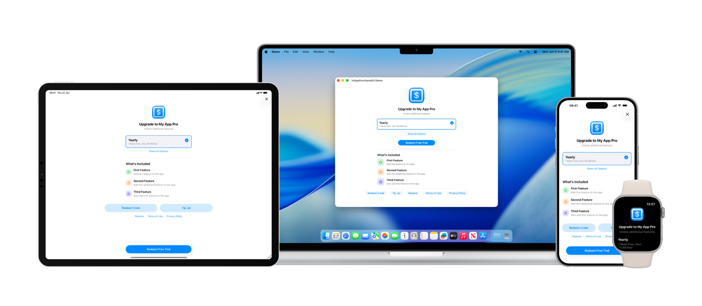

<p align="center">
    
</p>

<p align="center">
    
</p>

# InAppPurchaseKit

InAppPurchaseKit provides developers for Apple platforms with the ability to add a subscription screen to their apps. It also features an optional tip jar screen too and other views to show locked content. This is built using SwiftUI so can be displayed natively from a SwiftUI app or using a UIHostingController in a UIKit app.

<p align="center">
    
</p>

1. [Requirements](#requirements)
2. [Integration](#integration)
3. [Usage](#usage)
    - [InAppPurchaseKit](#inapppurchasekit)
    - [InAppPurchaseKitConfiguration](#inapppurchasekitconfiguration)
    - [PurchaseFeature](#purchasefeature)
    - [PurchaseTiers](#purchasetiers)
    - [PurchaseTierConfiguration](#purchasetierconfiguration)
    - [LegacyPurchaseTierConfiguration](#legacypurchasetierconfiguration)
    - [LegacyPurchaseThreshold](#legacypurchasethreshold)
    - [TipJarTiers](#tipjartiers)
    - [PurchaseTierConfiguration](#purchasetierconfiguration)
    - [LockedFeatureConfiguration](#lockedfeatureconfiguration)
    - [ProductsLoadState](#productsloadstate)
    - [PurchaseState](#purchasestate)
    - [InAppPurchaseView](#inapppurchaseview)
    - [LockedInAppPurchaseFeatureButton](#lockedinapppurchasefeaturebutton)
    - [LockedInAppPurchaseFeatureNavigationLink](#lockedinapppurchasefeaturenavigationlink)
    - [LockedInAppPurchaseFeatureRow](#lockedinapppurchasefeaturerow)
    - [LockedInAppPurchaseFeatureView](#lockedinapppurchasefeatureview)
    - [LockedInAppPurchaseWidgetView](#lockedinapppurchasewidgetview)
    - [InAppPurchaseSettingsRow](#inapppurchasesettingsrow)
    - [TipJarView](#tipjarview)
4. [Other Packages](#other-packages)
    - [AboutKit](https://github.com/adamfootdev/AboutKit)
    - [FeaturesKit](https://github.com/adamfootdev/FeaturesKit)
    - [HelpKit](https://github.com/adamfootdev/HelpKit)
    - [HapticsKit](https://github.com/adamfootdev/HapticsKit)

## Requirements

- iOS/iPadOS 17.0+
- macOS 14.4+
- tvOS 17.0+
- visionOS 1.0+
- watchOS 10.0+
- Xcode 17.0+

## Integration

### Swift Package Manager

InAppPurchaseKit can be added to your app via Swift Package Manager in Xcode. Add to your project like so:

```swift
dependencies: [
    .package(url: "https://github.com/adamfootdev/InAppPurchaseKit.git", from: "4.0.0")
]
```

## Usage

To start using the framework, you'll need to import it first:

```swift
import InAppPurchaseKit
```

### InAppPurchaseKit

InAppPurchaseKit can be accessed through the Observable class InAppPurchaseKit. You need to configure it during app launch, like so:

```swift
let inAppPurchase = InAppPurchaseKit.configure(
    with: configuration
)
```

As it is Observable, you can monitor it as a @State value for updating features in your app.

### InAppPurchaseKitConfiguration

This is a struct containing all of the relevant details required to configure InAppPurchaseKit. It can be created like so:

```swift
let configuration = InAppPurchaseKitConfiguration(
    "My App Pro",
    subtitle: "Unlock all features.",
    appName: "My App",
    imageName: "app_icon",
    systemImage: "plus.app",
    tintColor: .green,
    termsOfUseURL: URL(string: "https://example.com/terms-of-use")!,
    privacyPolicyURL: URL(string: "https://example.com/privacy-policy")!,
    features: [feature],
    tiers: tiers,
    legacyPurchaseThreshold: nil,
    tipJarTiers: tipJarTiers,
    sharedUserDefaults: .init(suiteName: "group.com.example.MyApp")!
) { product in
    print("Purchased \(product.displayName)")
} onUpdatedPurchases: {
    print("Updated Purchases")
}
```

### PurchaseFeature

This is a struct containing details about the features available. It can be created like so:

```swift
let feature = PurchaseFeature(
    title: "Feature",
    description: "About this feature.",
    systemImage: "checkmark",
    systemColor: .blue
)
```

### PurchaseTiers

This is a struct containing details about the subscription tiers. It can be created like so:

```swift
let tiers = PurchaseTiers(
    weeklyTier: nil,
    monthlyTier: monthlyConfiguration,
    yearlyTier: yearlyConfiguration,
    lifetimeTier: lifetimeConfiguration
)
```

### PurchaseTierConfiguration

This is a struct containing details about an individual tier. It can be created like so:

```swift
let configuration = PurchaseTierConfiguration(
    id: "com.example.MyApp.Pro.Yearly",
    alternateIDs: ["com.example.MyApp.Pro.OldYearly"],
    alwaysVisible: true,
    isPrimary: true,
    legacyConfiguration: legacyConfiguration
)
```

### LegacyPurchaseTierConfiguration

This is a struct containing details about a tier used for grandfathering in existing users when switching from paid to freemium. It can be created like so:

```swift
let configuration = LegacyPurchaseTierConfiguration(
    id: "com.example.MyApp.Pro.LegacyYearly",
    visible: true
)
```

### LegacyPurchaseThreshold

This is a struct containing details about when an app switched from paid to freemium so existing users can be grandfathered in or shown a discounted in-app purchase. It can be created like so:

```swift
let threshold = LegacyPurchaseThreshold(
    buildNumber: 100,
    version: "2.0"
)
```

### TipJarTiers

This is a struct containing details about the tip jar tiers if available. It can be created like so:

```swift
let tiers = TipJarTiers(
    smallTier: smallConfiguration,
    mediumTier: mediumConfiguration,
    largeTier: largeConfiguration,
    hugeTier: hugeConfiguration
)
```

### PurchaseTierConfiguration

This is a struct containing details about an tip jar tier. It can be created like so:

```swift
let configuration = TipJarTierConfiguration(
    id: "com.example.MyApp.Tip.Small"
)
```

### LockedFeatureConfiguration

This is a struct containing details about a locked feature. It can be created like so:

```swift
let configuration = LockedFeatureConfiguration(
    "Title",
    systemImage: "app",
    titleColor: .primary,
    enableIfLegacy: false
) {
    print("Purchased")
}
```

### ProductsLoadState

This is an enum that is used for indicating the current product load state. It can be accessed like so:

```swift
InAppPurchaseKit.shared.productsLoadState
```

It features the following states:

```swift
case .pending
```

This is the state before InAppPurchaseKit has loaded the in-app purchases.

```swift
case .loading
```

This state indicates InAppPurchaseKit is currently loading in-app purchases.

```swift
case .loaded(
    _ products: [Product],
    _ introOffers: [Product: Product.SubscriptionOffer],
    _ purchasedTiers: Set<PurchaseTier>,
    _ legacyUser: Bool
)
```

### PurchaseState

This is an enum that is used for indicating the current purchase state for the user. It also works for widgets/other extensions by checking UserDefaults. It can be accessed like so:

```swift
InAppPurchaseKit.shared.purchaseState
```

It features the following states:

```swift
case .pending
case .notPurchased
case .purchased
```

This is the method that should be used to determine if a user has purchased the subscription. It does not return purchased if the user is a legacy user, you should use the product load state for that.

### InAppPurchaseView

This is a view containing all of the in-app purchase options. It can be created like so:

```swift
InAppPurchaseView(
    includeNavigationStack: true,
    includeDismissButton: true,
    onPurchase onPurchaseAction: nil
)
```

It has options to include its own navigation stack and dismiss button which is useful for when displaying in a sheet instead of in an existing navigation stack. A separate purchase action can be added too.

### LockedInAppPurchaseFeatureButton

This is a view containing a button that performs an action when a user is subscribed or is locked when not. It can be created like so:

```swift
LockedInAppPurchaseFeatureButton(
    configuration: configuration,
    action: action
)
```

It includes configuration options and the action to perform when subscribed. It looks best in a list.

### LockedInAppPurchaseFeatureNavigationLink

This is a view containing a navigation link that shows a view when a user is subscribed or is locked when not. It can be created like so:

```swift
LockedInAppPurchaseFeatureNavigationLink(
    configuration: configuration,
    destination: destination
)
```

It includes configuration options and the view to show when subscribed. It looks best in a list.

### LockedInAppPurchaseFeatureRow

This is a view containing a custom view when a user is subscribed or is locked when not. It can be created like so:

```swift
LockedInAppPurchaseFeatureRow(
    configuration: configuration,
    content: content
)
```

It includes configuration options and the view to display when subscribed. It looks best in a list.

### LockedInAppPurchaseFeatureView

This is a view that displays the primary tier and the ability to show the in-app purchase sheet. It can be created like so:

```swift
LockedInAppPurchaseFeatureView(
    onPurchase: onPurchaseAction
)
```

It includes an action to perform when purchased.

### LockedInAppPurchaseWidgetView

This is a view that displays a locked view on a widget. It can be created like so:

```swift
LockedInAppPurchaseWidgetView(
    configuration: configuration,
    learnMoreURL: URL(string: "my://subscribe")!,
    tint: .green
)
```

It includes configuration options, a URL to open in the app when selected and an optional tint color. It will adapt to different widget families.

### InAppPurchaseSettingsRow

This is a view that displays the in-app purchase name and the ability to show the in-app purchase sheet if not subscribed or a subscribed message if the user is subscribed. It can be created like so:

```swift
InAppPurchaseSettingsRow(
    onPurchase: onPurchaseAction
)
```

It includes an action to perform when purchased. It looks best in a list.

### TipJarView

This is a view containing all of the tip jar tiers. It can be created like so:

```swift
TipJarView(
    includeNavigationStack: true,
    includeDismissButton: true
)
```

It has options to include its own navigation stack and dismiss button which is useful for when displaying in a sheet instead of in an existing navigation stack.

## Other Packages

### [AboutKit](https://github.com/adamfootdev/AboutKit)

Add an about screen to your app.

### [FeaturesKit](https://github.com/adamfootdev/FeaturesKit)

Add a features list screen to your app.

### [HelpKit](https://github.com/adamfootdev/HelpKit)

Add a help screen to your app.

### [HapticsKit](https://github.com/adamfootdev/HapticsKit)

Add haptic feedback to your app.
